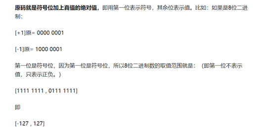
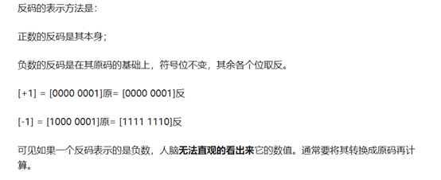

# 计算机基础补充

## 原码反码补码

学习原码、反码和补码之前，先了解机器数和真值的概念

### 机器数

一个数在计算机中的二进制表示形式，叫做这个数的机器数。机器数是带符号的，在计算机用机器数的最高位存放符号，正数为0，负数为1。

比如，十进制中的数 +3 ，计算机字长为8位，转换成二进制就是0000 0011。如果是 -3 ，就是 100 00011 。

那么，这里的 0000 0011 和 1000 0011 就是机器数。

### 机器数的真值

因为第一位是符号位，所以机器数的形式值就不等于真正的数值。

例如上面的有符号数 1000 0011，其最高位1代表负，其真正数值是 -3，而不是形式值131（1000 0011转换成十进制等于131）。所以，为区别起见，将带符号位的机器数对应的真正数值称为机器数的真值。

例：0000 0001的真值 = +000 0001 = +1，1000 0001的真值 = -000 0001 = -1

### 原码, 反码, 补码的基础概念和计算方法  

在探求为何机器要使用补码之前，让我们先了解原码、反码和补码的概念。对于一个数，计算机要使用一定的编码方式进行存储，原码、反码、补码是机器存储一个具体数字的编码方式。

### 原码

### 反码

