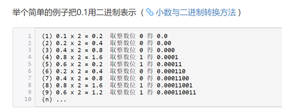

# 数据类型结构

## 数据类型

​		Java是一种强类型语言，这就意味着必须为每一个变量声明一种类型。在Java中，一共有8种基本类型，其中4种整形，2种浮点类型，1种用于表示Unicode编码的字符单元的字符类型char和1种用于表示真假的boolean类型。

### 整形

| 类型  | 存储需求  |         取值范围         |
| :---: | :-------: | :----------------------: |
| byte  | 1字节8位  |      【-27，27-1】       |
| short | 2字节16位 |     【-215，215-1】      |
|  int  | 4字节32位 | 【-231，231-1】 超过20亿 |
| long  | 8字节64位 |     【-263，263-1】      |

#### byte

​		主要用于节省内存空间的关键，当操作来自网络、文件或者其他IO的数据流的时候，byte类型特别有用，byte的默认值为0，如果我们试图将取值范围外的值赋给byte类型变量，则会出现编译错误，例如byte b=128;这个语句是无法通过编译的。一个有趣的问题，如果我们有个方法： public void test(byte b)。试图这么调用这个方法是错误的: test(0); 编译器会报错，类型不兼容！！！我们记得byte b=0；这是完全没有问题的，为什么在这里就出错啦？这里涉及到一个叫字面值（literal）的问题，字面值就是表面上的值，例如整型字面值在源代码中就是诸如 5 ， 0， -200这样的。如果整型子面子后面加上L或者l，则这个字面值就是long类型，比如：1000L代表一个long类型的值。如果不加L或者l，则为int类型。基本类型当中的byte short int long都可以通过不加L的整型字面值（我们就称作int字面值吧）来创建，例如 byte b = 100； short s = 5；对于long类型，如果大小超出int所能表示的范围（32 bits），则必须使用L结尾来表示。

#### short

​		short可能不是租常用的类型了，可以通过整形字面值或者字符字面值赋值，前提是不超过范围（16bit）。Short类型参与运算的时候，一样被提升为int或者更高的类型（顺序为byte、short、int、long、float、double）。

#### int

​		有符号的二进制补码表示的整数，常用于控制循环，注意byte和short在运算中会被提升为int类型或更高，Java8以后，可以使用int类型表示无符号32位整数[0,231-1]。

#### long

​		默认值为0L，当需要计算非常大的数时，如果int不足以容纳大小，可以使用long类型。如果long也不够，可以使用BigInteger类。

### 浮点类型

|  类型  | 存储需求  |   取值范围    |
| :----: | :-------: | :-----------: |
| float  | 4字节32位 |  有效位数6-7  |
| double | 8字节64位 | 有效位数15-16 |

#### float

​		使用32 bit表示，对应单精度浮点数，运行速度相比double更快，占内存更小，但是当数值非常大或者非常小的时候会变得不精确。精度要求不高的时候可以使用float类型。可以将byte、short、int、long、char赋给float类型，java自动完成转换。

#### double

​		将浮点字面值赋给某个变量时，如果不显示在字面值后面加f或者F，则默认为double类型。java.lang.Math中的函数都采用double类型。如果double和float都无法达到想要的精度，可以使用BigDecimal类。例如计算0.05+0.01的时候会出现精度丢失的问题，返回值为0.060000000000000005，小数转换为二进制换算方法（二进制小数转换为十进制小数则小数点后按位除2）

得到一个无线循环的二进制小数，没办法用一个精确的二进制表示0.1，而且计算机中存储一个浮点数所用的位数也是有限的，所以只能选择在某一个精度进行保存。浮点数值不适用于禁止出现舍入误差的金融计算中，例如打印（2.0-1.1）值为0.8999999999999999，而不是人们想象的0.9。其主要原因是浮点数值采用二进制系统表示，而在二进制系统中无法精确的表示分数1/10。这就好像十进制无法精确地表示1/3一样。如果需要在数值计算中不含有任何舍入误差，就应该使用BigDecimal类。

### char类型

​		Char类型用于表示单个字符。通常用来表示字符常量。例如：‘A’是编码为65所对应的字符常量。与‘A’不同，‘A’是一个包含字符A的字符串。Unicode编码单元可以表示为十六进制数值，其范围从\u0000到\Uffff。例如：\u2122表示注册符号。

| 转义序列 |  名称  | Unicode数值 |
| :------: | :----: | :---------: |
|    \b    |  退格  |   \u0008    |
|    \t    |  制表  |   \u0009    |
|    \n    |  换行  |   \u000a    |
|    \r    |  回车  |   \u000d    |
|    \“    | 双斜杠 |   \u0022    |
|    \’    | 单斜杠 |   \u0027    |
|    \\    | 反斜杠 |   \u005c    |

Char占2字节，16位，用单引号标识，只能放单个字符。基本运算：char+char，char+int 类型均提升为int，赋值char变量后，输出字符编码表中对应的字符。

### 数值类型之间的转换

运算之间的转换，先要将两个操作数转换为同一种类型，然后再进行计算：

1. 如果两个操作数中有一个是double类型，另一个操作数就会转换为double类型
2. 否则，如果其中一个操作数是float类型，另一个操作数就会转换为float类型
3.  否则，如果其中一个操作数是long类型，另一个 操作数就会转换为long类型
4. 否则，两个操作数都将被转换为int类型。