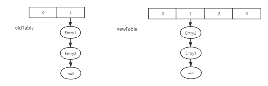

# JDK1.7 HashMap

## 类的层级关系

```java
public class HashMap<K,V>
    extends AbstractMap<K,V>
    implements Map<K,V>, Cloneable, Serializable
```

## 类的相关属性

```java
// 默认初始容量，必须为2的幂。
static final int DEFAULT_INITIAL_CAPACITY = 1 << 4;
// 最大容量，如果在构造函数中有指定最大容量的值，则使用这个最大容量值，但该值必须<= 1<<30。
static final int MAXIMUM_CAPACITY = 1 << 30;
// 负载系数，当HashMap的容量大于（容量*0.75）时，则需扩容。
static final float DEFAULT_LOAD_FACTOR = 0.75f;
// 一个空的Entry数组，当变量table未扩容时，用来共享的实例。
static final Entry<?,?>[] EMPTY_TABLE = {};
// 扩容的时候必须要使用到table，扩容后长度必须是2的幂。
transient Entry<K,V>[] table = (Entry<K,V>[]) EMPTY_TABLE;
// 表示HashMap中存放KV的数量。
transient int size;
// 表示当HashMap的size大于threshold时会执行resize操作。
int threshold;
// 装载因子，装载因子用来衡量HashMap满的程度。loadFactor的默认值为0.75f。计算HashMap的实时装载因子的方法为：size/capacity。
final float loadFactor;
// 用于记录HashMap的操作次数。
transient int modCount;
// 一个默认的阈值，当一个键值对的键是String类型时，且map的容量达到了这个阈值，就启用备用哈希。备用哈希可以减少String类型的key计算哈希码（更容易）发生哈希碰撞的发生率。该值可以通过定义系统属性jdk.map.althashing.threshold来指定。如果该值是1，表示强制总是使用备用哈希；如果是-1则表示禁用。
static final int ALTERNATIVE_HASHING_THRESHOLD_DEFAULT = Integer.MAX_VALUE;
// Hash种子，会影响hash运算。
transient int hashSeed = 0;
```

## 构造函数

​		当我们new一个HashMap的时候，底层源码干了什么事情。它会调用HashMap的重载构造函数，并且传递【默认的容量大小】和【扩容因子】，分别是【1<<4】和【0.75f】。

```java
public HashMap() {
    this(DEFAULT_INITIAL_CAPACITY, DEFAULT_LOAD_FACTOR);
}
```

​		【容量大小】必须小于等于【1<<30】，将默认的的扩容因子赋值给loadFactor,此时的threshold为默认的容量大小。此时会调用HashMap的子类【LinkedHashMap】的init方法。

```java
public HashMap(int initialCapacity, float loadFactor) {
    if (initialCapacity < 0)
        throw new IllegalArgumentException("Illegal initial capacity: " +
                                           initialCapacity);
    if (initialCapacity > MAXIMUM_CAPACITY)
        initialCapacity = MAXIMUM_CAPACITY;
    if (loadFactor <= 0 || Float.isNaN(loadFactor))
        throw new IllegalArgumentException("Illegal load factor: " +
                                           loadFactor);

    this.loadFactor = loadFactor;
    threshold = initialCapacity;
    init();
}
```

​		LinkedHashMap的init方法会初始化一个Entry数组（header），并且初始化header的头尾指针。

```java
@Override
void init() {
    header = new Entry<>(-1, null, null, null);
    header.before = header.after = header;
}
```

## 常用方法原理

### put

```java
public V put(K key, V value) {
    if (table == EMPTY_TABLE) {
        inflateTable(threshold);
    }
    if (key == null)
        return putForNullKey(value);
    int hash = hash(key);
    int i = indexFor(hash, table.length);
    for (Entry<K,V> e = table[i]; e != null; e = e.next) {
        Object k;
        if (e.hash == hash && ((k = e.key) == key || key.equals(k))) {
            V oldValue = e.value;
            e.value = value;
            e.recordAccess(this);
            return oldValue;
        }
    }

    modCount++;
    addEntry(hash, key, value, i);
    return null;
}
```

​		1. table为空时，将默认容量16传入inflateTable方法执行

```java
private void inflateTable(int toSize) {
    // Find a power of 2 >= toSize
    // roundUpToPowerOf2将返回大于toSize的2的幂次方数，得到容量大小。
    int capacity = roundUpToPowerOf2(toSize);
	// 根据容量大小计算出threshold阈值。
    threshold = (int) Math.min(capacity * loadFactor, MAXIMUM_CAPACITY + 1);
    // 初始化table数组大小。
    table = new Entry[capacity];
    // 初始化HashSeed。
    initHashSeedAsNeeded(capacity);
}
```

```
i. hashSeed默认为0，所以currentAltHashing为false。
ii. isBooted()判断VM是否启动 执行后为true,ALTERNATIVE_HASHING_THRESHOLD为Integer.MAX_VALUE，所以useAltHashing为false。
iii. 最终HashSeed为0。
```

```java
final boolean initHashSeedAsNeeded(int capacity) {
    boolean currentAltHashing = hashSeed != 0;
    boolean useAltHashing = sun.misc.VM.isBooted() &&
        (capacity >= Holder.ALTERNATIVE_HASHING_THRESHOLD);
    boolean switching = currentAltHashing ^ useAltHashing;
    if (switching) {
        hashSeed = useAltHashing
            ? sun.misc.Hashing.randomHashSeed(this)
            : 0;
    }
    return switching;
}
```

​		2. key为null时，执行putForNullKey

```
遍历table数组索引0号位的链表
1)   如果该链表中key为null存在，则覆盖该value值，结束。
2)   不存在，则利用头插法，在该索引位插入一条Entry。
```

```java
private V putForNullKey(V value) {
    for (Entry<K,V> e = table[0]; e != null; e = e.next) {
        if (e.key == null) {
            V oldValue = e.value;
            e.value = value;
            e.recordAccess(this);
            return oldValue;
        }
    }
    modCount++;
    addEntry(0, null, value, 0);
    return null;
}
```

​		3. 根据key计算hash值

```
用hashSeed和key的hashcode值做异或运算
注：hashcode中用31作为因子，是因为31是质数
```

```java
final int hash(Object k) {
    int h = hashSeed;
    if (0 != h && k instanceof String) {
        return sun.misc.Hashing.stringHash32((String) k);
    }

    h ^= k.hashCode();

    // This function ensures that hashCodes that differ only by
    // constant multiples at each bit position have a bounded
    // number of collisions (approximately 8 at default load factor).
    h ^= (h >>> 20) ^ (h >>> 12);
    return h ^ (h >>> 7) ^ (h >>> 4);
}
```

​		4. 根据hash值和table的长度计算数组下标索引

```java
static int indexFor(int h, int length) {
    // assert Integer.bitCount(length) == 1 : "length must be a non-zero power of 2";
    // 对hash值 和（table 的长度- 1）进行&运算，这样不管hash多大，最终计算出来的索引范围是（0~（table.length-1））
    return h & (length-1);
}
```

​		5. 遍历table所有索引位，判断是否需要覆盖key-value

```java
// 遍历每个索引位，当条件满足时，覆盖value值，并调用子类的recordAccess方法。覆盖value值之后直接return。
for (Entry<K,V> e = table[i]; e != null; e = e.next) {
    Object k;
    if (e.hash == hash && ((k = e.key) == key || key.equals(k))) {
        V oldValue = e.value;
        e.value = value;
        e.recordAccess(this);
        return oldValue;
    }
}
```

​		6. addEntry内部逻辑

```
1)	判断size是否大于扩容阈值并且计算出来的索引在table中是否存在。
2)	满足条件时，扩容2倍的table容量
3)	扩容之后，重新计算当前key的hash值，并且根据hash值计算在新table的索引。
4)	利用头插法，在新table中插入Entry。
```

```java
void addEntry(int hash, K key, V value, int bucketIndex) {
    if ((size >= threshold) && (null != table[bucketIndex])) {
        resize(2 * table.length);
        hash = (null != key) ? hash(key) : 0;
        bucketIndex = indexFor(hash, table.length);
    }

    createEntry(hash, key, value, bucketIndex);
}

void createEntry(int hash, K key, V value, int bucketIndex) {
    Entry<K,V> e = table[bucketIndex];
    table[bucketIndex] = new Entry<>(hash, key, value, e);
    size++;
}
```

​		 7. resize

```
1)	首先new 了 一个扩容两倍后的新table。
2)	将旧table的数据transfer到新数组。
3)	再将table指向newTable。
4)	然后再更新扩容阈值。
```

```java
void resize(int newCapacity) {
    Entry[] oldTable = table;
    int oldCapacity = oldTable.length;
    if (oldCapacity == MAXIMUM_CAPACITY) {
        threshold = Integer.MAX_VALUE;
        return;
    }

    Entry[] newTable = new Entry[newCapacity];
    transfer(newTable, initHashSeedAsNeeded(newCapacity));
    table = newTable;
    threshold = (int)Math.min(newCapacity * loadFactor, MAXIMUM_CAPACITY + 1);
}
```

​		8. transfer

```
1)	首先，遍历旧数组的每一个链表。
2)	判断是否需要rehash，是的话需要根据key重新算出hash值。
3)	然后根据新的table的长度和hash计算出索引值。
4)	利用头插法插入新table中。
5)	继续遍历链表，直到e.next为空。
注：多线程情况下，会产生死循环。
```

```java
void transfer(Entry[] newTable, boolean rehash) {
    int newCapacity = newTable.length;
    for (Entry<K,V> e : table) {
        while(null != e) {
            Entry<K,V> next = e.next;
            if (rehash) {
                e.hash = null == e.key ? 0 : hash(e.key);
            }
            int i = indexFor(e.hash, newCapacity);
            e.next = newTable[i];
            newTable[i] = e;
            e = next;
        }
    }
}
```

​		**多线程环形链表的形成**



1. 当线程A执行完扩容操作时，线程B从next = e.next开始执行。

2. 此时e和e.next分别指向Entry1和Entry2。（还处于未扩容时的分别指向）

   **第一次循环**

   

   **第二次循环**


​		**第三次循环**（**产生死循环**）


### remove方法

1. 根据key计算得到索引下标，获取该下标的链表

2. 循环该链表，判断两个 key和hash值，相同则进行删除的逻辑，否则进入下一次循环并对next节点进行判断

3. 细节：中间的if-else是判断 要删除的节点是在头部还是在其他部位，

**如果在头部的话，删除头节点并把table[i]指向头节点的next节点。**

**如果在其他部位的话，删除某节点后，将prev节点和next节点相连。**

**注：remove方法底层实际上是调用HashMap的子类LinkedHashMap的remove方法，主要实现逻辑是断开‘要删除的节点’在链表的prev-next关系，断开它与其他节点的引用关系，这样它就失去引用就会被gc回收**

```java
public V remove(Object key) {
    Entry<K,V> e = removeEntryForKey(key);
    return (e == null ? null : e.value);
}
```

```java
final Entry<K,V> removeEntryForKey(Object key) {
    if (size == 0) {
        return null;
    }
    int hash = (key == null) ? 0 : hash(key);
    int i = indexFor(hash, table.length);
    Entry<K,V> prev = table[i];
    Entry<K,V> e = prev;

    while (e != null) {
        Entry<K,V> next = e.next;
        Object k;
        if (e.hash == hash &&
            ((k = e.key) == key || (key != null && key.equals(k)))) {
            modCount++;
            size--;
            if (prev == e)
                table[i] = next;
            else
                prev.next = next;
            e.recordRemoval(this);
            return e;
        }
        prev = e;
        e = next;
    }

    return e;
}
```

### get方法

1. Key为null时，循环遍历table[0]的链表，判断每个节点的key，当key为空则返回该value值

2. 不为null时，计算hash值后根据indexFor得出索引下标，遍历该链表判断hash与key值相同则返回该value值 

```java
public V get(Object key) {
    if (key == null)
        return getForNullKey();
    Entry<K,V> entry = getEntry(key);

    return null == entry ? null : entry.getValue();
}
```


## LinkedHashMap

### 构造器

调用了HashMap的构造方法，默认按插入顺序排序

**注：LinkedHashMap的读取顺序有 按插入顺序和按访问顺序**

```java
public LinkedHashMap() {
    super();
    accessOrder = false;
}
```


### 常用方法原理

### put方法

​		LinkedHashMap的put方法继承自HashMap的put方法，并且扩展了父类的addEntry方法，自身的addEntry调用了HashMap的addEntry。LinkedHashMap还扩展了父类的createEntry方法。

```java
// LinkedHashMap扩展了HashMap的addEntry方法
void addEntry(int hash, K key, V value, int bucketIndex) {
    super.addEntry(hash, key, value, bucketIndex);

    // Remove eldest entry if instructed
    Entry<K,V> eldest = header.after;
    if (removeEldestEntry(eldest)) {
        removeEntryForKey(eldest.key);
    }
}
// LinkedHashMap扩展了HashMap的createEntry方法
void createEntry(int hash, K key, V value, int bucketIndex) {
    HashMap.Entry<K,V> old = table[bucketIndex];
    Entry<K,V> e = new Entry<>(hash, key, value, old);
    table[bucketIndex] = e;
    e.addBefore(header);
    size++;
}
```

1. 获取 计算出来索引位置（bucketIndex）的链表，即为old。

2. new一个Entry实例，该实例的next指针指向原来的链表，即指向old。

3. 刷新该链表。

4. 调用e.addBefore(haader)的过程如下。

```java
private void addBefore(Entry<K,V> existingEntry) {
    after  = existingEntry;
    before = existingEntry.before;
    before.after = this;
    after.before = this;
}
```


### get方法

​		LinkedHashMap扩展了HashMap的get方法，和HashMap的get方法差不多，只是增加了e.recordAccess方法，主要用于刷新该Map的读取顺序。

```java
public V get(Object key) {
    Entry<K,V> e = (Entry<K,V>)getEntry(key);
    if (e == null)
        return null;
    e.recordAccess(this);
    return e.value;
}
```

​		判断accessOrder为true时，即读取顺序为“访问顺序”时，会remove当前的元素，然后再将该元素 充当一个新的元素插入到链表的尾部。这样我们输出该Map时，就是以“访问顺序”的形式输出。


Thank ！