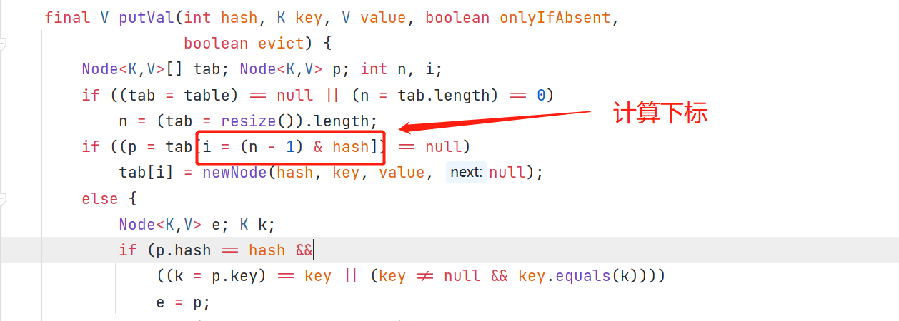

# JDK1.8 HashMap


## 介绍

​		相信看过HashMap1.7的朋友应该知道，1.7底层的设计是动态数组+链表的结构，而1.8基于它之上引入了红黑树的概念。为什么要引入红黑树？对比1.7引入红黑树有哪些好处？我们将带着这些问题从源码的层面去找出答案。			

## 类层级关系

```java
public class HashMap<K,V> extends AbstractMap<K,V>
    implements Map<K,V>, Cloneable, Serializable
```

## 成员属性

​		相比1.7多了**TREEIFY_THRESHOLD**、**UNTREEIFY_THRESHOLD**、**MIN_TREEIFY_CAPACITY**这几个属性，也是红黑树几个关键的属性。

```java
// 默认初始容量 - 必须是 2 的幂。
static final int DEFAULT_INITIAL_CAPACITY = 1 << 4;
// 最大容量, 必须是 2 的幂 <= 1<<30。
static final int MAXIMUM_CAPACITY = 1 << 30;
// 默认负载因子。
static final float DEFAULT_LOAD_FACTOR = 0.75f;
// 链表长度达到8后转化为红黑树。该值必须大于 2 且至少应为 8
static final int TREEIFY_THRESHOLD = 8;
// 链表长度收缩到6后退化为链表。
static final int UNTREEIFY_THRESHOLD = 6;
// 红黑树的最小容量
static final int MIN_TREEIFY_CAPACITY = 64;
// 哈希表，在第一次使用时初始化，并根据需要调整大小。 分配时，长度始终是 2 的幂。 
transient Node<K,V>[] table;
// 保存缓存的 entrySet()。 请注意，AbstractMap 字段用于 keySet() 和 values()。
transient Set<Map.Entry<K,V>> entrySet;
// 此映射中包含的键值映射数。
transient int size;
// 该 HashMap 被结构修改的次数
transient int modCount;
// 容量 * 负载因子,达到该阈值后进行扩容
int threshold;
// 哈希表的负载因子。
final float loadFactor;
```

## 构造函数

```java
// 构造一个具有指定初始容量和负载因子的空HashMap 。
public HashMap(int initialCapacity, float loadFactor) {
    if (initialCapacity < 0)
        throw new IllegalArgumentException("Illegal initial capacity: " +
                                           initialCapacity);
    if (initialCapacity > MAXIMUM_CAPACITY)
        initialCapacity = MAXIMUM_CAPACITY;
    if (loadFactor <= 0 || Float.isNaN(loadFactor))
        throw new IllegalArgumentException("Illegal load factor: " +
                                           loadFactor);
    this.loadFactor = loadFactor;
    // 初始化扩容阈值
    this.threshold = tableSizeFor(initialCapacity);
}
// 构造一个具有指定初始容量和默认负载因子 (0.75) 的空HashMap 。
public HashMap(int initialCapacity) {
    this(initialCapacity, DEFAULT_LOAD_FACTOR);
}
// 构造一个具有默认初始容量 (16) 和默认负载因子 (0.75) 的空HashMap 
public HashMap() {
    this.loadFactor = DEFAULT_LOAD_FACTOR; // all other fields defaulted
}
// 使用与指定Map相同的映射构造一个新的HashMap 。 HashMap是使用默认负载因子 (0.75) 创建的，初始容量足以在指定的Map 中保存映射。
public HashMap(Map<? extends K, ? extends V> m) {
    this.loadFactor = DEFAULT_LOAD_FACTOR;
    putMapEntries(m, false);
}
// 返回给定目标容量的二次幂。
// 假设给定7，则返回8。给定17，则返回32。
static final int tableSizeFor(int cap) {
    int n = cap - 1;
    n |= n >>> 1;
    n |= n >>> 2;
    n |= n >>> 4;
    n |= n >>> 8;
    n |= n >>> 16;
    return (n < 0) ? 1 : (n >= MAXIMUM_CAPACITY) ? MAXIMUM_CAPACITY : n + 1;
}
```

## 常用方法

​		当我们put一个元素的时候，它会根据我们传入的key去做hash运算，hash运算步骤如下：

1. 取key的hashCode值（根据key的数据类型调用对应的hashCode方法，此处以String类型为例）。
2. 将hashCode值进行无符号右移16位。
3. 将hashCode值与右移之后的结果进行异或运算得到hash值。

​        右移16位的作用是为了减少碰撞，更好的避免hash冲突，作异或运算主要是能够保留hashcode的高16位与低16位各自的特征。那为什么需要将高16位也参与到运算中呢？我们可以看到HashMap源码是通过**(n-1)&hash** 去计算存储下标的，那如果**n**（数组大小）的值还不到16位呢？那是不是hash的高16位是没有参与运算的，所以让高16位参与运算主要是计算存储下标时能够更加均匀分布。



```java
public V put(K key, V value) {
    return putVal(hash(key), key, value, false, true);
}

static final int hash(Object key) {
    int h;
    // h是key的hashcode值， 与它自身的hashcode无符号右移之后 做异或运算
    return (key == null) ? 0 : (h = key.hashCode()) ^ (h >>> 16);
}
// 此为String类的hashCode方法
public int hashCode() {
    int h = hash;
    if (h == 0 && value.length > 0) {
        char val[] = value;
        for (int i = 0; i < value.length; i++) {
            h = 31 * h + val[i];
        }
        hash = h;
    }
    return h;
} 
```

​		我们具体来看看put的步骤

```java
final V putVal(int hash, K key, V value, boolean onlyIfAbsent,
               boolean evict) {
    Node<K,V>[] tab; Node<K,V> p; int n, i;
    // 如果tab为空，则初始化哈希表
    if ((tab = table) == null || (n = tab.length) == 0)
        // 用n记录resize后哈希表的大小
        n = (tab = resize()).length;
    // 根据哈希表的长度-1 与 hash值 做 与运算
    // 例如哈希表长度为32，则计算 31 & hash
    // 如果该索引位上为空，才可赋值（在该索引位上新建一个节点）
    if ((p = tab[i = (n - 1) & hash]) == null)
        tab[i] = newNode(hash, key, value, null);
    else {
        // 如果该索引位上不为空，说明该位置上 已经存在一个节点或者一条链表
        Node<K,V> e; K k;
        // ① 该索引位上的hash值与新计算出来的hash值相等
        // ② 该索引位上的key与新的key相等
        // 满足①和②则进行覆盖
        // 不管是一个节点或者一条链表都会覆盖
        if (p.hash == hash &&
            ((k = p.key) == key || (key != null && key.equals(k))))
            e = p;
        // 如果索引位上的元素类型是TreeNode，即此时链表已经转换为红黑树了。
        else if (p instanceof TreeNode)
            // 使用红黑树的方式插入元素
            e = ((TreeNode<K,V>)p).putTreeVal(this, tab, hash, key, value);
        else {
            // 开始遍历链表
          	// 此时链表的长度是小于8的，还没有转化为红黑树
            for (int binCount = 0; ; ++binCount) {
                // 如果e是空的话，说明链表的当前元素是最后一个元素
                // 遍历到链表的最后都没有匹配到相同的key，则在链表的末尾新增一个元素
                if ((e = p.next) == null) {
                    // 如果p.next为空，则根据key、value初始化一个新的元素赋值给p.next
                    // 这里可以看出采用的是尾插法
                    p.next = newNode(hash, key, value, null);
                    // 链表增加了元素，需判断链表的长度是否达到了8
                    if (binCount >= TREEIFY_THRESHOLD - 1) // -1 for 1st
                        // 达到了8则转化为红黑树
                        treeifyBin(tab, hash);
                    // 跳出循环，此时的e为空
                    break;
                }
                // e不为空的情况
                // 遍历过程中，发现链表中存在相同的key
                if (e.hash == hash &&
                    ((k = e.key) == key || (key != null && key.equals(k)))) // **
                    // 跳出循环，执行（existing mapping for key）
                    break;
                // 指向下一个节点
                p = e;
            }
        }
        // 覆盖哈希表中已经存在的key，即上面标记为**处
        if (e != null) { // existing mapping for key
            V oldValue = e.value;
            if (!onlyIfAbsent || oldValue == null)
                e.value = value;
            afterNodeAccess(e);
            return oldValue;
        }
    }
    // 记录操作次数
    ++modCount;
    // 新增元素之后如果超过扩容阈值，需要进行扩容。
    // 注意1.7是先扩容再插入元素，而1.8是先插入元素再扩容
    if (++size > threshold)
        resize(); 
    afterNodeInsertion(evict);
    return null;
}
```

​		总结大概的流程：		

1.  首先，判断哈希表是否需要初始化（表的初始化工作）

2.  接着， 计算新节点的索引位记为new_index。 

3.  如果new_index在当前哈希表上不存在一个节点或链表，则新建一个节点放到该索引位上；

    ​	 不相等则判断第一个节点是否是红黑树类型，是则以红黑树的方式插入节点；

   ​	 不是红黑树则以普通链表的方式插入节点。

   ​	 普通插入时，遍历链表并判断链表中有无相同的节点，相同则要覆盖。最主要的是要检查链表长度是否达到了红黑树的阈值8，达到了就要将链表转化为红黑树。


​		经过上面put的源码解析，可以知道1.7和1.8的不同之处。

 1）**1.8**的底层数据结构是数组+链表+红黑树，链表长度达到8的时候会将链表转化为红黑树；1.7是没有红黑树的。

 2）**1.8**是先插入元素再扩容，**1.7**是先扩容再插入元素。

 3）**1.8**采用链表尾插法，**1.7**采用链表头插法。

 4）hash运算不同。**1.7**使用了4次**位运算+**5次**异或；**1.8**只用了**2次**扰动处理=1**次位运算**+**1次**异或。效率上来说应该是1.8占优势，从hash冲突的概率来说暂时不晓得。但是冲突的解决思路**1.7**采用**数组+链表**，**1.8**采用**数组+链表+红黑树**，时间复杂度从O（n）变成O（nlogN）从而提高了效率。总体1.8还是基于1.7做了相应的优化的。

​		我们新增一个节点，计算出这个节点的索引位上已经有一个类型是红黑树的链表，这个时候就要根据红黑树的方式插入节点了，看看具体是怎么实现的。

```java
final TreeNode<K,V> putTreeVal(HashMap<K,V> map, Node<K,V>[] tab,
                               int h, K k, V v) {
    Class<?> kc = null;
    boolean searched = false;
    // 从红黑树的根节点开始遍历
    TreeNode<K,V> root = (parent != null) ? root() : this;
    for (TreeNode<K,V> p = root;;) {
        int dir, ph; K pk;
        // 此时树节点的hash 大于 新节点的hash
        if ((ph = p.hash) > h)
            // 此时，新节点插入的方向是左边
            dir = -1;
        // 此时树节点的hash 小于 新节点的hash
        else if (ph < h)
            // 此时，新节点插入的方向是右边
            dir = 1;
        // 新节点与此时树节点 的key相同，覆盖其值
        else if ((pk = p.key) == k || (k != null && k.equals(pk)))
            // 直接返回此时的树节点
            return p;
        // 走到这步，说明此时树节点和新节点的key 的内存地址以及两者的equals均不相等
        else if ((kc == null &&
                  (kc = comparableClassFor(k)) == null) ||
                 (dir = compareComparables(kc, k, pk)) == 0) {
            // 新节点没有实现Comparable接口 
           	// 或者 
            // 实现了Comparable接口 并与 新节点是同类（通过==比较后类相同）
            
          	// 这里主要是搜寻树结构中是否有equals方法比较后相同的节点
		   // 找到之后返回出去
            if (!searched) {
                TreeNode<K,V> q, ch;
                searched = true;
                // 先从树的左侧开始搜寻，左侧如果找到立即返回，不再搜寻右侧树
                if (((ch = p.left) != null &&
                     (q = ch.find(h, k, kc)) != null) ||
                    ((ch = p.right) != null &&
                     (q = ch.find(h, k, kc)) != null))
                    return q;
            }
            // 走到这里，说明上一步没有search到相同的节点。 
            // 这个方法是最终确认要插入的节点是位于树的左侧还是右侧，
            // 调用本地方法生成hashcode再比较。
            dir = tieBreakOrder(k, pk);
        }
	    // 这一步， 插入的方向已经确定了。
        TreeNode<K,V> xp = p;
     	// 方向确定之后， 判断左子节点或右子节点是否为空， 不为空则需要进行下一次的遍历
        // 为空，则进行插入的逻辑
        if ((p = (dir <= 0) ? p.left : p.right) == null) {
            // 当前树节点的next节点
            Node<K,V> xpn = xp.next;
            // 新建一个树节点，并设置新节点的 xpn节点（当前树节点的next节点）
            TreeNode<K,V> x = map.newTreeNode(h, k, v, xpn);
            if (dir <= 0)
                // 置于左侧
                xp.left = x;
            else
                // 置于右侧
                xp.right = x;
            // 当前树节点的next节点 重新指定为 此时的新节点
            xp.next = x;
            // 新节点的parent、prev均指向当前树节点（xp）
            x.parent = x.prev = xp;
            if (xpn != null)
                 // 当前树节点的next节点的prev指向当前新节点
                ((TreeNode<K,V>)xpn).prev = x;
            // 维护红黑树平衡
            moveRootToFront(tab, balanceInsertion(root, x));
            return null;
        }
    }
}
```

转化为红黑树主要是这个方法**treeifyBin**，它的实现逻辑是怎样的呢？

```java
final void treeifyBin(Node<K,V>[] tab, int hash) {
    int n, index; Node<K,V> e;
    // 如果元素数组为空 或者 数组长度小于 树结构化的最小限制
    // MIN_TREEIFY_CAPACITY 默认值64，对于这个值可以理解为：如果元素数组长度小于这个值，没有必要去进行结构转换
    // 当一个数组位置上集中了多个键值对，那是因为这些key的hash值和数组长度取模之后结果相同。（并不是因为这些key的hash值相同）
    // 因为hash值相同的概率不高，所以可以通过扩容的方式，来使得最终这些key的hash值在和新的数组长度取模之后，拆分到多个数组位置上。
    if (tab == null || (n = tab.length) < MIN_TREEIFY_CAPACITY)
        resize();
    // 根据数组的长度和hash进行与运算后，得到链表的头节点
    else if ((e = tab[index = (n - 1) & hash]) != null) {
        // 定义头尾节点
        TreeNode<K,V> hd = null, tl = null;
        do {
            // 遍历链表，生成树节点
            TreeNode<K,V> p = replacementTreeNode(e, null);
            // 如果尾节点为空，说明没有根节点
            if (tl == null)
                // 头节点指向当前节点
                hd = p;
            else {
                // 尾节点不空，将当前节点的prev指向尾节点
                p.prev = tl;
                // 尾节点的next指向当前节点
                tl.next = p;
            }
            // 此时，尾节点指向当前节点
            tl = p;
        } while ((e = e.next) != null); // 继续遍历链表
        // 上面的步骤已经把单向链表转换为双向链表了
        if ((tab[index] = hd) != null)
            // 将双向链表树化
            hd.treeify(tab);
    }
}
```

​		以下是树化的过程

```java
final void treeify(Node<K,V>[] tab) {
    TreeNode<K,V> root = null;
    // 此时的x是双向链表的头节点4
    for (TreeNode<K,V> x = this, next; x != null; x = next) {
        // x的next节点
        next = (TreeNode<K,V>)x.next;
        // 定义左右子节点
        x.left = x.right = null;
        // 初始化树的根节点为x
        if (root == null) {
            // 父节点为空
            x.parent = null;
            // 根节点为黑色
            x.red = false;
            // x赋值给root节点
            root = x;
            // 进行下一次循环，此时x为x的next节点
        }
        else 
            // 根节点已存在
            // 记录当前节点的key和hash值
            K k = x.key;
            int h = x.hash;
            Class<?> kc = null;
            // 定位当前节点需要插入到树的什么位置
            // 遍历树结构，从根节点开始
            for (TreeNode<K,V> p = root;;) {
                // ph -> 当前树节点的hash值
                // dir -> 标记方向，左或右 
                int dir, ph;
                // 记录当前树节点的key
                K pk = p.key;
                // 如果当前树节点的hash值 大于 当前链表元素的hash值
                if ((ph = p.hash) > h)
                    // 标记当前树节点为-1，即左侧
                    dir = -1;
                else if (ph < h)
                    // 否则，为右侧
                    dir = 1;
               	// 走到这步，说明此时树节点和新节点的key 的内存地址以及两者的equals均不相等
                else if ((kc == null &&
                          (kc = comparableClassFor(k)) == null) ||
                         (dir = compareComparables(kc, k, pk)) == 0)
                    // 这个方法是最终确认要插入的节点是位于树的左侧还是右侧，
           		   	// 调用本地方法生成hashcode再比较。
                    dir = tieBreakOrder(k, pk);
				
                // 如果dir 小于等于0 ： 当前链表节点一定放置在当前树节点的左侧，但不一定是该树节点的左孩				子，也可能是左孩子的右孩子 或者 更深层次的节点。
                // 如果dir 大于0 ： 当前链表节点一定放置在当前树节点的右侧，但不一定是该树节点的右孩子，也					可能是右孩子的左孩子 或者 更深层次的节点。
                // 按上述方式逐层递归，直到找到要插入树节点的位置（即当前树节点的左或右子节点为空）
                // 挂载之后，还需要重新把树进行平衡。平衡之后，就可以针对下一个链表节点进行处理了。
                TreeNode<K,V> xp = p;
                if ((p = (dir <= 0) ? p.left : p.right) == null) {
                    x.parent = xp;
                    if (dir <= 0)
                        xp.left = x;
                    else
                        xp.right = x;
                    // 插入平衡可以参考1.7的put方法
                    root = balanceInsertion(root, x);
                    break;
                }
            }
        // 继续下一次循环
        }
    }
	// 重新指定红黑树的root节点
	// 用来将root节点放入到哈希槽中，保证其处于哈希桶的头部
    moveRootToFront(tab, root);
}
```

### remove

```java
public V remove(Object key) {
    Node<K,V> e;
    // 删除之前先计算key的hash值
    return (e = removeNode(hash(key), key, null, false, true)) == null ?
        null : e.value;
}

final Node<K,V> removeNode(int hash, Object key, Object value,
                           boolean matchValue, boolean movable) {
    // tab -> 当前的数组
    // p -> 存放该key在数组的索引位上的链表
    // n -> 记录数组的大小
    // index -> 索引下标
    Node<K,V>[] tab; Node<K,V> p; int n, index;
    if ((tab = table) != null && (n = tab.length) > 0 &&
        // 此时p指向的是对应索引位上的链表
        (p = tab[index = (n - 1) & hash]) != null) {
        // node -> 要删除的元素
        // k -> 作为一个临时变量去存储元素的key
        // v -> 记录要删除元素的value
        Node<K,V> node = null, e; K k; V v;
        // ① 链表首元素的hash和形参的hash相同
        // ② 链表首元素的key相同
        // 同时满足①、②，则链表的首元素就是我们要删除的元素
        if (p.hash == hash &&
            ((k = p.key) == key || (key != null && key.equals(k))))
            node = p;
        // 首元素的next元素不为空
        else if ((e = p.next) != null) {
            // 如果此时的p（即首元素）属于TreeNode类型，即此时的链表是红黑树的结构
            if (p instanceof TreeNode)
                // 采用红黑树的方式来获取要删除的元素
                node = ((TreeNode<K,V>)p).getTreeNode(hash, key);
            else {
                // 如果不是红黑树的结构，只是单纯的双向链表结构。
                // 则正常的遍历链表来找到要删除的元素
                // 以下do-while循环就是遍历链表去定位要删除的元素
                do {
                    if (e.hash == hash &&
                        ((k = e.key) == key ||
                         (key != null && key.equals(k)))) {
                        node = e;
                        break;
                    }
                    p = e;
                } while ((e = e.next) != null);
            }
        }
        if (node != null && (!matchValue || (v = node.value) == value ||
                             (value != null && value.equals(v)))) {
            // 如果要删除的元素属于TreeNode类型
            if (node instanceof TreeNode)
                // 则使用树结构的方式去删除该元素
                ((TreeNode<K,V>)node).removeTreeNode(this, tab, movable);
            else if (node == p)
                // 如果要删除的元素刚好是链表的头元素
                // 直接将该数组索引位上的链表往下挪一个元素
                // 即断开头元素的引用
                tab[index] = node.next;
            else
                // 以上两种情况都不是，即说明此时要删除的元素处于链表的非头元素位置上。
                // 这种情况直接将头元素的next指针指向要删除的元素的next域即可。
                p.next = node.next;
            ++modCount;
            --size;
            afterNodeRemoval(node);
            return node;
        }
    }
    return null;
}

// 关键还是要看 要删除的元素处于红黑树 的结构状态下，该如何删除
final void removeTreeNode(HashMap<K,V> map, Node<K,V>[] tab,
                          boolean movable) {
    // 定义n记录数组的长度
    int n;
    if (tab == null || (n = tab.length) == 0)
        return;
    // 计算要删除的元素在数组中的索引
    int index = (n - 1) & hash;
    // first -> 获取对应索引的链表
    // root -> 指向first，起到一个游标的作用
    // rl -> 临时变量
    TreeNode<K,V> first = (TreeNode<K,V>)tab[index], root = first, rl;
    // succ -> 要删除元素的下一个元素
    // pred -> 要删除元素的上一个元素
    TreeNode<K,V> succ = (TreeNode<K,V>)next, pred = prev;
    // pred为空说明要删除的元素是链表的头元素
    if (pred == null)
        // 将succ赋值给此时的索引位和first
        tab[index] = first = succ;
    else
        // 不为空则说明是非头元素
        // 将上一个元素的next指向succ
        pred.next = succ;
    // 如果succ不空，succ的上一个元素指向pred
    if (succ != null)
        succ.prev = pred;
    // 
    if (first == null)
        return;
    // 定位链表的根节点
    if (root.parent != null)
        root = root.root();
    // 从红黑树退化成链表
    if (root == null
        || (movable
            && (root.right == null
                || (rl = root.left) == null
                || rl.left == null))) {
        tab[index] = first.untreeify(map);  // too small
        return;
    }
    // 还没达到退化链表的条件
    // p -> 待删除元素
    // pl -> 待删除元素的左子元素
    // pr -> 待删除元素的右子元素
    // replacement -> 替换元素
    TreeNode<K,V> p = this, pl = left, pr = right, replacement;
    // 待删除元素有左右子元素
    if (pl != null && pr != null) {
        TreeNode<K,V> s = pr, sl;
        // 找到后继元素
        while ((sl = s.left) != null) // find successor
            s = sl;
        // c -> 后继元素的颜色
        // 交换后继节点和删除节点的颜色，最终的删除是后继节点，故平衡是否是以后继节点的颜色来判断的
        boolean c = s.red; s.red = p.red; p.red = c; // swap colors
        // sr -> 后继元素的右子元素（后继元素肯定不存在左子元素）
        TreeNode<K,V> sr = s.right;
        // pp -> p的父元素，待删除元素的父元素
        TreeNode<K,V> pp = p.parent; 
        // 如果后继节点与待删除元素的右孩子相等，类似于待删除元素有一个右子元素，右子元素没有任何子元素
        if (s == pr) { // p was s's direct parent
            // 待删除元素的父元素和右子元素位置互换
            p.parent = s;
            s.right = p;
        }
        else {
            // 如果待删除元素的右子元素有至少一个左子元素
            TreeNode<K,V> sp = s.parent;
            // 将后继元素的父元素赋值给p.parent，并判断不为空
            if ((p.parent = sp) != null) {
                // 后继元素是它父元素的左子元素
                if (s == sp.left)
                    // 修改父元素的左子元素为p
                    sp.left = p;
                else // 后继元素是它父元素的右子元素
                    // 修改父元素的右子元素为p
                    sp.right = p;
            }
            // 修改后继节点的右孩子值，如果不为null，同时指定其父节点的值
            if ((s.right = pr) != null)
                pr.parent = s;
        }
        // 当前节点现在变成后继节点了，故其左孩子为null.
        p.left = null;
        // 修改当前节点的右孩子值，如果其不为空，同时修改其父节点指向当前节点
        if ((p.right = sr) != null)
            sr.parent = p;
        // 修改后继节点的左孩子值，如果其不为空，同时修改其父节点指向后继节点
        if ((s.left = pl) != null)
            pl.parent = s;
        // 修改后继节点的父节点值，如果其为null，说明后继节点现在变成了root节点
        if ((s.parent = pp) == null)
            root = s;
         // 当前节点是其父节点的左孩子
        else if (p == pp.left)
            pp.left = s;
        // 当前节点是其父节点的右孩子
        else
            pp.right = s;
        /**
        * sr-后继节点的右孩子节点（有一个孩子节点），
        * 如果右孩子节点不为空，删除节点后，替代节点就是其右孩子节点
        * 如果为空，那么替代节点就是其本身
        */
        if (sr != null)
            replacement = sr;
        else
            replacement = p;
    }
    // 删除节点有一个左子节点，左子节点作为替代节点
    else if (pl != null)
        replacement = pl;
    // 删除节点有一个右子节点，右子节点作为替代节点
    else if (pr != null)
        replacement = pr;
    // 删除节点没有子节点，直接删除当前节点
    else
        replacement = p;
    /**
    * 如果删除节点存在两个孩子节点，最终与后继节点交换后，删除的节点的位置位于后继节点的位置，那么此时删除节点所处的位置演变成：
    * a、只有一个孩子节点：(replacement = p.right) != p
    * b、没有孩子节点：replacement == p
    * 只有当删除节点与替换节点不相等的时候，才对删除节点进行删除操作
    */
    if (replacement != p) {
        // 从红黑树中将待删除节点（即当前节点移除）
        TreeNode<K,V> pp = replacement.parent = p.parent;
         // 是否为根节点
        if (pp == null)
            root = replacement;
         // 其父节点的左子节点
        else if (p == pp.left)
            pp.left = replacement;
        // 其父节点的右子节点
        else
            pp.right = replacement;
        // 节点的指向全部置NULL
        p.left = p.right = p.parent = null;
    }
        /**
        * 如果删除节点的颜色是红色，不会影响整棵树的黑色高度，毋需自平衡，根节点不会变化，如果是黑色，则需要进行自平衡，重新获取根节点
        * 注意：
        * 自平衡的时候 替代节点可能与删除节点相等：replacement == p
        * 自平衡的时候 替代节点可能与删除节点不相等：replacement ！= p
        */
    TreeNode<K,V> r = p.red ? root : balanceDeletion(root, replacement);
        /**
        * 当 replacement == p 时，是先进行了红黑树的进行了平衡操作，再将这个节点从红黑树中移除
        * 这个地方我也没明白原理是什么，但是我按照这个步骤去走了一遍，确实这样操作来完成平衡，如果有哪位大神明白的，麻烦指导一下，谢谢！
        */
    if (replacement == p) {  // detach
         // pp-存储当前节点的父节点值
        TreeNode<K,V> pp = p.parent;
        // 当前节点的父节点指向NULL
        p.parent = null;
        // 如果父节点不为空，根据当前节点位于父节点的不同子节点，修改父节点的孩子节点值
        if (pp != null) {
            if (p == pp.left)
                pp.left = null;
            else if (p == pp.right)
                pp.right = null;
        }
    }
    // movable为true，需要将根节点移动到头节点，即数组所以位置指向的节点
    if (movable)
        moveRootToFront(tab, r);
}
```

```java
/**
* 红黑树删除节点后，平衡红黑树的方法
*
* @param root 根节点
* @param x    节点删除后，替代其位置的节点，这个节点可能是一个节点，也可能是一棵平衡的红黑树，在此处就当作一个节点，在该节点以上部分需要自平衡
* @return 返回新的根节点
*/
static <K, V> HashMap.TreeNode<K, V> balanceDeletion(HashMap.TreeNode<K, V> root, HashMap.TreeNode<K, V> x) {
    /**
    * 进入这个方法，说明被替代的节点之前是黑色的，如果是红色的不会影响黑色高度，黑色的会影响以其作为根节点子树的黑色高度
    * xp-父节点,xpl-父节点的左孩子,xpr-父节点的右孩子节点
    * 注意：
    *    进入该方法的时候 替代节点可能与删除节点相等：x == replacement == p
    *                  替代节点可能与删除节点不相等：x == replacement ！= p
    */
    for (HashMap.TreeNode<K, V> xp, xpl, xpr; ; ) {
        /**
        * 1、x == null，当 replacement == p 时，删除节点不存在，返回；
        *      因为当 replacement ！= p 时，replacement 肯定不会为null.在移除节点的方法中有三个地方对 replacement 进行赋值。
        *          1、if (sr != null) replacement = sr;
        *          2、if (pl != null) replacement = pl;
        *          3、if (pr != null) replacement = pr;
        * 2、x == root，如果替代完成后，该节点就是整棵红黑树的根节点，本身就是平衡的，直接返回
        */
        if (x == null || x == root)
            return root;
        else if ((xp = x.parent) == null) {
            // 如果父节点为空，说明当前节点就是根节点，设置根节点的颜色为黑色，返回
            x.red = false;
            return x;
        } else if (x.red) {
            /**
            * 被替换节点（删除节点）的颜色是黑色的，删除之后黑色高度减1，如果替换节点是红色，将其设置为黑色，可以保证
            * 1、与替换之前的黑色高度相等
            * 2、满足红黑树的所有特性
            * 达到平衡返回
            */
            x.red = false;
            return root;
            /**
            * 如果替换节点是黑色的，替换之前的节点也是黑色的，替换之后，以替换节点作为根节点子树黑色高度减少1，需要进行相关的自平衡操作
            * 1、替换节点是父节点的左孩子
            */
        } else if ((xpl = xp.left) == x) {
            /**
            * 情况1、父节点的右孩子（兄弟节点）存在且为红色
            * 处理方式：兄弟节点变黑，父节点变红，以父节点为支点进行左旋，重新获取兄弟节点，继续参与自平衡
            */
            if ((xpr = xp.right) != null && xpr.red) {
                xpr.red = false;
                xp.red = true;
                root = rotateLeft(root, xp);
                xpr = (xp = x.parent) == null ? null : xp.right;
            }

            // 不存在兄弟节点，x指向父节点，向上调整
            if (xpr == null)
                x = xp;
            else {
                // sl-兄弟节点的左孩子，sr-兄弟节点的右孩子
                HashMap.TreeNode<K, V> sl = xpr.left, sr = xpr.right;
                /**
                * 情况2-1：兄弟节点存在，且两个孩子的颜色均为黑色
                * 1、sr == null || !sr.red：兄弟的右孩子为黑色（空节点的颜色其实也是黑色）
                * 2、sl == null || !sl.red：兄弟的左孩子为黑色（空节点的颜色其实也是黑色）
                * 处理方式：兄弟节点为红色，替换节点指向父节点，继续参与自平衡
                */
                if ((sr == null || !sr.red) && (sl == null || !sl.red)) {
                    xpr.red = true;
                    x = xp;
                } else {
                    /**
                    * 该条件综合评价为：兄弟节点的右孩子为黑色
                    * 1、sr == null：兄弟的右孩子为黑色（空节点的颜色其实也是黑色）
                    * 2、!sr.red：兄弟节点的右孩子颜色为黑色
                    */
                    if (sr == null || !sr.red) {
                        /**
                        * sl != null：兄弟的左孩子是存在且颜色是红色的
                        * 情况2-2、兄弟节点右孩子为黑色、左孩子为红色
                        * 处理方式：兄弟节点的左孩子设为黑色，兄弟节点设为红色，以兄弟节点为支点进行右旋，重新设置x的兄弟节点，继续参与自平衡
                        */
                        if (sl != null)
                            sl.red = false;
                        xpr.red = true;
                        root = rotateRight(root, xpr);
                        xpr = (xp = x.parent) == null ? null : xp.right;
                    }
                    /**
                    * 情况2-3、兄弟节点的右孩子是红色
                    * 处理方式：
                    * 1、如果兄弟节点存在，兄弟节点的颜色设置为父节点的颜色
                    * 2、兄弟节点的右孩子存在，颜色设为黑色
                    * 3、如果父节点存在，将父节点的颜色设为黑色
                    * 4、以父节点为支点进行左旋
                    */
                    if (xpr != null) {
                        xpr.red = (xp == null) ? false : xp.red;
                        if ((sr = xpr.right) != null)
                            sr.red = false;
                    }
                    // 父节点不为空
                    if (xp != null) {
                        xp.red = false;
                        root = rotateLeft(root, xp);
                    }
                    // 替换节点指向根节点，平衡完成
                    x = root;
                }
            }
        } else {
            /**
            * 替换节点是父节点的右孩子节点
            * 情况1、兄弟节点存在且为红色
            * 处理方式：兄弟节点变黑，父节点变红，以父节点为支点进行左旋，重新获取兄弟节点，继续参与自平衡
            */
            if (xpl != null && xpl.red) {
                xpl.red = false;
                xp.red = true;
                root = rotateRight(root, xp);
                xpl = (xp = x.parent) == null ? null : xp.left;
            }
            // 不存在兄弟节点，x指向父节点，向上调整
            if (xpl == null)
                x = xp;
            else {
                // sl-兄弟节点的左孩子，sr-兄弟节点的右孩子
                HashMap.TreeNode<K, V> sl = xpl.left, sr = xpl.right;
                /**
                * 情况2-1：兄弟节点存在，且两个孩子的颜色均为黑色
                * 1、sr == null || !sr.red：兄弟的右孩子为黑色（空节点的颜色其实也是黑色）
                * 2、sl == null || !sl.red：兄弟的左孩子为黑色（空节点的颜色其实也是黑色）
                * 处理方式：兄弟节点为红色，替换节点指向父节点，继续参与自平衡
                */
                if ((sl == null || !sl.red) && (sr == null || !sr.red)) {
                    xpl.red = true;
                    x = xp;
                } else {
                    /**
                    * 该条件综合评价为：兄弟节点的左孩子为黑色
                    * 1、sr == null：兄弟的左孩子为黑色（空节点的颜色其实也是黑色）
                    * 2、!sr.red：兄弟节点的左孩子颜色为黑色
                    */
                    if (sl == null || !sl.red) {
                        /**
                        * sl != null：兄弟的右孩子是存在且颜色是红色的
                        * 情况2-2、兄弟节点左孩子为黑色、右孩子为红色
                        * 处理方式：兄弟节点的右孩子设为黑色，兄弟节点设为红色，以兄弟节点为支点进行左，重新设置x的兄弟节点，继续参与自平衡
                        */
                        if (sr != null)
                            sr.red = false;
                        xpl.red = true;
                        root = rotateLeft(root, xpl);
                        xpl = (xp = x.parent) == null ? null : xp.left;
                    }
                    /**
                    * 情况2-3、兄弟节点的左孩子是红色
                    * 处理方式：
                    * 1、如果兄弟节点存在，兄弟节点的颜色设置为父节点的颜色
                    * 2、兄弟节点的左孩子存在，颜色设为黑色
                    * 3、如果父节点存在，将父节点的颜色设为黑色
                    * 4、以父节点为支点进行右旋
                    */
                    if (xpl != null) {
                        xpl.red = (xp == null) ? false : xp.red;
                        if ((sl = xpl.left) != null)
                            sl.red = false;
                    }
                    if (xp != null) {
                        xp.red = false;
                        root = rotateRight(root, xp);
                    }
                    // 替换节点指向根节点，平衡完成
                    x = root;
                }
            }
        }
    
```

