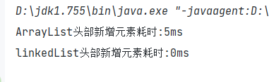

#  LinkedList(双向链表)

## 类的层级关系

```java
public class LinkedList<E>
    extends AbstractSequentialList<E>
    implements List<E>, Deque<E>, Cloneable, java.io.Serializable
```

## 类的相关属性

```java
// LinkedList链表中元素的大小
transient int size = 0;
// 头节点和尾节点，遍历链表就是从头节点或者尾节点开始的
transient Node<E> first;
transient Node<E> last;
```

## 构造函数

```java
public LinkedList() {
}
```

```java
public LinkedList(Collection<? extends E> c) {
    this();
    addAll(c);
}
```

## 特点

​		我们在平时开发的时候，一般用的比较多的是ArrayList。ArrayList是用**动态数组**实现的，就是你不需要像普通数组那样去指定数组的初始化大小，因为ArrayList是动态扩容的，使用起来比较灵活。由于ArrayList是基于动态数组实现的，所以它**读取元素效率高**，直接根据索引读取；但是它进行插入或删除操作的时候，效率就没有想象那么好了；而LinkedList相当于是与它互补的存在，两者不能相互替代，应该根据实际场景去选择，后面我也会具体分析一下它们的执行效率，以便供大家参考。

## 常用方法底层原理

```java
public boolean add(E e) {
    linkLast(e);
    return true;
}

void linkLast(E e) {
    // 用一个临时变量指向last节点
    final·
    // 每次新增的节点的prev节点指向l，next节点默认指向null，因为默认新增在链表的尾部
    final Node<E> newNode = new Node<>(l, e, null);
    // 每次新增，都需要将last指向newNode
    last = newNode;
    // 如果l指向null，说明是第一次新增
    if (l == null)
        // 第一次新增，需要维护first节点指向newNode（只需要维护一次）
        first = newNode;
    else
        // 后续的新增操作，只需要维护l的next指向当前新增的节点 即可
        l.next = newNode;
    // 
    size++;
    // 记录修改次数
    modCount++;
}
```


**大概就是**

1. 首先，有两个指针① first和② last它们的任务分别是：

   ① 始终指向第一个节点（此动作在新增的时候只需要维护一次，即链表为空的时候）。

   ② 始终指向最后一个节点（每次新增的时候都要维护）。

2. NewNode记为新增的节点，NewNode默认新增在链表的尾部，需要维护：

   ① NewNode的prev节点指向 last 节点。

   ② NewNode的prev节点的next指向 NewNode。
   
3. NewNode如果是根据索引下标进行插入新增的，这里分两种情况：

   ① 如果索引传的刚好是链表的size大小，即在尾部新增。

   ② 否则，遍历链表找到对应索引的节点，在该索引位进行插入新增。
   
   注：如果在链表的头部进行插入，需要重新指定新增的节点为first节点。

这里针对**第三种情况**进行分析，先看看源码是咋写的：

```java
public void add(int index, E element) {
    // 索引越界校验
    checkPositionIndex(index);
	// 这里是上面的第一种情况①
    if (index == size)
        // 在尾部新增，上面有介绍就不讲了
        linkLast(element);
    else
        // 这里是上面的第二种情况②
        linkBefore(element, node(index));
}
```

​		linkBefore是在链表的某个元素之前去进行插入的。element参数是实际要插入的元素，node(index)就要根据传入的索引去查找元素（因为我要知道在哪个元素之前插入，讲remove方法的时候会介绍），我们先看看linkBefore怎么实现的。

```java
void linkBefore(E e, Node<E> succ) {
    // assert succ != null;
    // 记录当前索引位置的上一个节点
    final Node<E> pred = succ.prev;
    // 新建一个节点，将该节点的上一个节点指向pred，下一个节点指向当前索引的节点
    final Node<E> newNode = new Node<>(pred, e, succ);
    // 将下一个节点的prev指向当前新增的节点
    succ.prev = newNode;
    // 判断pred指向是否为空，为空则说明是在头部新增节点
    if (pred == null)
        // 需要维护first节点指向新增的节点
        first = newNode;
    else
        // 不为空则说明是在中间新增节点，需要将pred的next指向当前新增的节点
        pred.next = newNode;
    size++;
    modCount++;
}
```

尾部插入上面介绍过了，来看看中间位置和头部的插入，直接上图。

###### 

**下面我们来分析一下删除一个节点需要怎么操作**

​	我们先不看源码，给你一个简单的双向链表，删除 item1 、item2、item3，分别需要怎么做？


**我们先来简单分析一波**

1. 首先，来看看删除 item3 节点（尾节点），注意 item3 是链表的最后一个节点。因为要删除item3，所以需要重新维护 last 的指向（ last 应该指向 item3 的 prev 节点，即 item2 ），而 item3 的 prev 节点的 next 指针 应该指向 item3 的next节点 （即 null）。

2. 如果是删除 itme2 节点（中间节点），则不需要考虑重新维护 first 和 last 的指向。但是这里需要维护：

   ① item2 的 prev 节点 的 next 指向下一个节点。

   ② item2 的 next 节点的 prev 指向上一个节点。

3. 最后，删除 item1 节点（头节点），则需要维护 first 的指向（应该指向 item1 的 next 节点），而 item1 的 next 节点 的 prev 指向应该为 null 。

**LinkedList对节点的删除方法有两种**，一种是根据**对象删除**，另一种是根据**索引删除**。首先，要怎么**根据对象**进行删除呢？它是遍历整个链表，然后通过对象的 equals 方法找到该对象进行删除，此处判断对象是否相等可以根据实际去重写对象的 equals 方法来实现。

下面我们先具体讲讲通过索引删除的具体方式，LinkedList底层是通过判断传入的索引值是大于还是小于**链表size的一半**（其实就是传入的索引是**靠前半截链表**还是**后半截**）。如果是靠近前半截则从链表的头部开始遍历；后半截则从尾部遍历，通过其中一个遍历方式找到该节点进行删除，这也是双项链表的特点。

```java
Node<E> node(int index) {
    // assert isElementIndex(index);
    // 判断索引靠近前半截还是后半截链表
    if (index < (size >> 1)) {
        // 靠近前半截，则利用 first 节点开始往后逐渐遍历
        Node<E> x = first;
        for (int i = 0; i < index; i++)
            // 指向下一个节点
            x = x.next;
        // 循环结束，返回找到的节点
        return x;
    } else {
        // 靠近后半截，则利用 last 节点开始往前逐渐遍历
        Node<E> x = last;
        for (int i = size - 1; i > index; i--)
            // 指向上一个节点
            x = x.prev;
       	// 循环结束，返回找到的节点
        return x;
    }
}
```

上面我们通过索引的方式找到了要删除的节点，找到节点后可以直接进行删除的操作。而我们所知道的单链表是不具备这种优势的，单链表只能找到要删除的节点的**上一个节点**才能进行删除。下面就是进行节点的删除操作了

```java
E unlink(Node<E> x) {
    // x 为当前要删除的节点
    
    // assert x != null; 
    final E element = x.item;
    final Node<E> next = x.next;
    final Node<E> prev = x.prev;
	// 如果它的上一个节点是null，说明啥？
    // 说明它是头节点
    if (prev == null) {
        // 这里就是我们上面所分析的，将 first 节点指向它的下一个节点
        first = next;
    } else {
        // 既然它不是头节点，只能是中间节点或者是尾节点
        // 不管是中间还是尾部，它们的共同点就是
        // 都需要将上一个节点的next指向下一个节点
        prev.next = next;
        // 它都将要被删除了，那它的prev节点应该指向null
        x.prev = null;
    }
	// 判断是不是尾部节点，是则将 last 节点指向 上一个节点
    if (next == null) {
        last = prev;
    } else {
        // 如果是中间节点，要将下一个节点的 prev 指向上一个节点
        next.prev = prev;
        // 它都将要被删除了，那它的next节点应该指向null
        x.next = null;
    }
	// 最后将item也置为null
    x.item = null;
    // 最后的结果为【item->null】【prev->null】【next->null】
    size--;
    modCount++;
    return element;
}
```

好了，下面我们来分析一下通过**对象的方式**怎么进行删除，直接附上源码：

```java
public boolean remove(Object o) {
    // 判断删除的是不是空对象
    if (o == null) {
        // 从头开始遍历链表
        for (Node<E> x = first; x != null; x = x.next) {
            // 直接粗暴的判断是不是空对象，是的话直接把它干掉
            if (x.item == null) {
                // 这个方法上面已经分析过了
                unlink(x);
                return true;
            }
        }
    } else {
        for (Node<E> x = first; x != null; x = x.next) {
            // 这里直接是通过 equals 判断，这里可以去重写对象的equals方法，实现自定义规则
            if (o.equals(x.item)) {
                unlink(x);
                return true;
            }
        }
    }
    return false;
}
```

## 效率分析

​		分析之前，我们需要知道ArrayList和LinkedList两者影响效率的点在哪？

1. ​	ArrayList达到容量瓶颈时会执行grow方法对容量扩容，扩容后的容量是扩容前的**1.5倍**，并且会执行Arrays.copyOf方法，将原有数组copy到新数组中。

   如果在尾部插入就只需要考虑扩容的问题；

   如果在中间插入还需要考虑原数组**部分元素**的迁移问题；

   如果在头部插入则需要考虑原数组**所有元素**的迁移问题。

   既然它每次扩容都是之前的1.5倍，那随着**新增元素的量**增加，它**扩容的频率**会逐渐少。

   ```java
   private void grow(int minCapacity) {
       // overflow-conscious code
       int oldCapacity = elementData.length;
       // 可以看出扩容后的容量是扩容前的1.5倍
       // 好比扩容前是10，扩容后是15；扩容前是15，扩容后就是22
       int newCapacity = oldCapacity + (oldCapacity >> 1);
       if (newCapacity - minCapacity < 0)
           newCapacity = minCapacity;
       if (newCapacity - MAX_ARRAY_SIZE > 0)
           newCapacity = hugeCapacity(minCapacity);
       // minCapacity is usually close to size, so this is a win:
       elementData = Arrays.copyOf(elementData, newCapacity);
   }
   
   // Arrays.copyOf底层是System.arraycopy方法，这个方法是直接调用本地接口（Java Native Interface，直接调用C代码），既然都不是使用Java语言开发就不管它源代码啦，它的效率还是比较好的
   public static <T,U> T[] copyOf(U[] original, int newLength, Class<? extends T[]> newType) {
       T[] copy = ((Object)newType == (Object)Object[].class)
           ? (T[]) new Object[newLength]
           : (T[]) Array.newInstance(newType.getComponentType(), newLength);
       System.arraycopy(original, 0, copy, 0,
                        Math.min(original.length, newLength));
       return copy;
   }
   
   public static native void arraycopy(Object src,  int  srcPos,
                                       Object dest, int destPos,
                                       int length);
   ```

   

2. LinkedList则不需要考虑扩容.

   但是随着**新增元素的量**增加，需要不断分配新的内存空间再进行引用；
   
   在获取元素的时候。如果要获取的元素越靠近链表的**中间**，则效率越低。

经过上面分析之后，下面我们通过代码来实测一下

首先，测试一下AyyayList和LinkedList在尾部新增30000个元素的效率

```java
public static void main(String[] args) {
    List<Integer> list = new ArrayList<>();
    long addStartTime = System.currentTimeMillis();
    for(int i = 0; i < 30000; i ++) {
        list.add(i);
    }
    long addEndTime = System.currentTimeMillis();
    System.out.println("ArrayList尾部新增30000元素耗时:" + (addEndTime - addStartTime) + "ms");

    List<Integer> linkedList = new LinkedList<>();
    long addStartTime2 = System.currentTimeMillis();
    for(int i = 0; i < 30000; i ++) {
        linkedList.add(i);
    }
    long addEndTime2 = System.currentTimeMillis();
    System.out.println("linkedList尾部新增30000元素耗时:" + (addEndTime2 - addStartTime2) + "ms");
}
```


可以看到，**LinkedList的耗时略低**

随着新增元素量的增加，到差不多**600000**的时候，**两者效率达到持平**。


当数量达到**100万**的时候，**ArrayList的效率明显优于LinkedList。**


<font style=background:yellow;color:black>**可以看出来，随着新增的元素越多，LinkedList的效率是不及ArrayList的。因为新增的元素越多，ArrayList需要扩容的频率就会呈一个下降的趋势，由于是在尾部新增的，所以ArrayList只有需要扩容的时候才会将元素copy到新的索引中**。**而LinkedList则需要不断地创建新的内存空间去引用。**</font>

看一下如果在头部插入元素，两者又是怎样的效率呈现。

首先，ArrayList如果在头部新增元素，有两种情况：

1. 当数组容量**足够**时，在**原数组**先将元素copy到**新的索引**位置中，然后再将新增的元素插入到头部。
2. 当数组容量**不够**时，先进行**扩容**，然后将**原数组**的元素copy到**新数组的新的索引**位置中，最后再将新增的元素插入到头部。


<font style="background:yellow;color:black">很明显，不管ArrayList扩不扩容都需要将所有的元素都copy到新的索引中。对于LinkedList来说，只需要维护first节点的指向即可。**所以在头部新增，随着新增的数量增加LinkedList要略优于ArrayList的**</font>

下面在两者的size均达到1000万的情况下，在头部新增元素，LinkedList是比ArrayList的效率高一点的，这点效率其实可以忽略不记。



同样在数据1000万的情况下，在中间插入元素，LinkedList的效率肯定不及ArrayList的。


插入讲完了，我们再看看删除的效率，其实通过上面的分析之后，两者删除的效率已经很明显了

**在尾部删除**


**在中间删除**


**在头部删除**


两者如何选用？

1. 如果只是将数据装载到容器中做一个临时存储，并且数据量在百万级别以下的，两者都可以选择，但一般我们开发中都使用ArrayList。如果达到了百万级别以上的，要使用ArrayList了，LinkedList需要频繁创建内存空间而ArrayList扩容的频率相对下降了。
2. 如果需要频繁在容器做一些数据插入或者删除的动作，需要衡量是在头部、尾部还是中间位置。如果靠中间位置居多的话，可以使用ArrayList；不靠中间位置则可以使用LinkedList。
