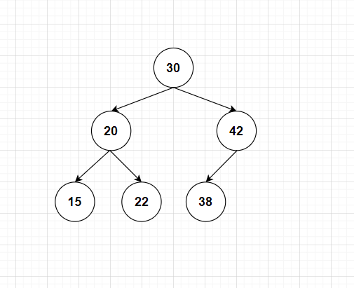
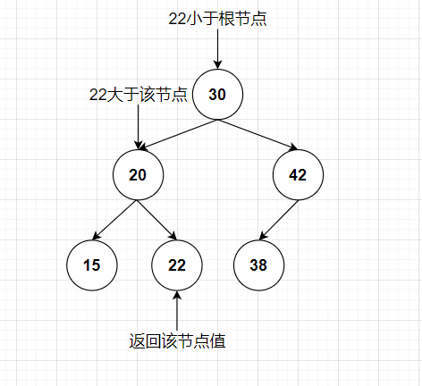
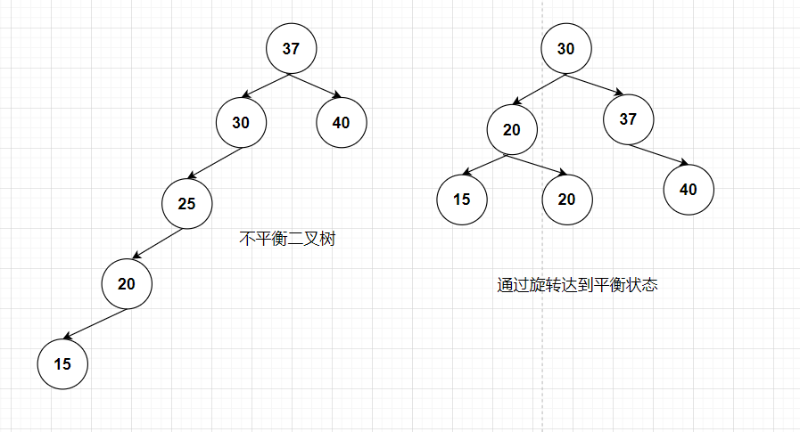
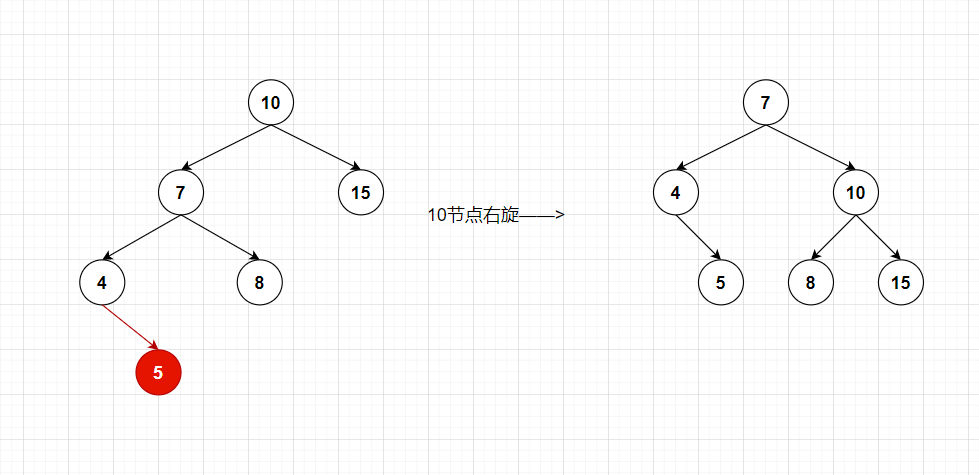
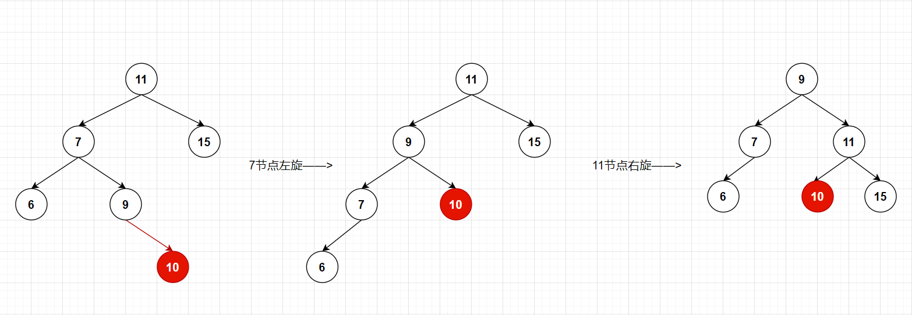
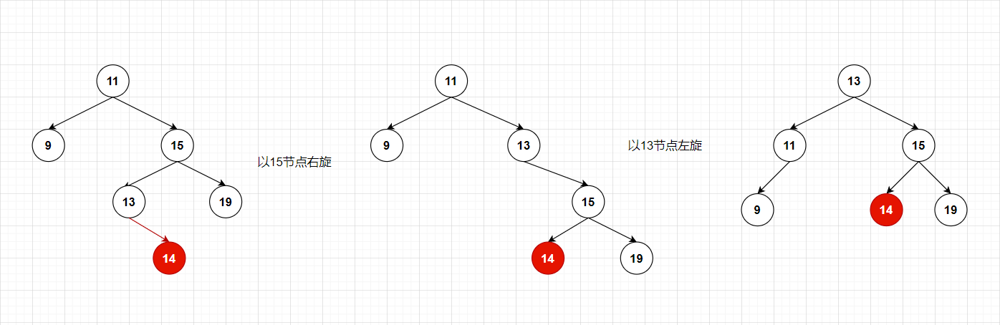
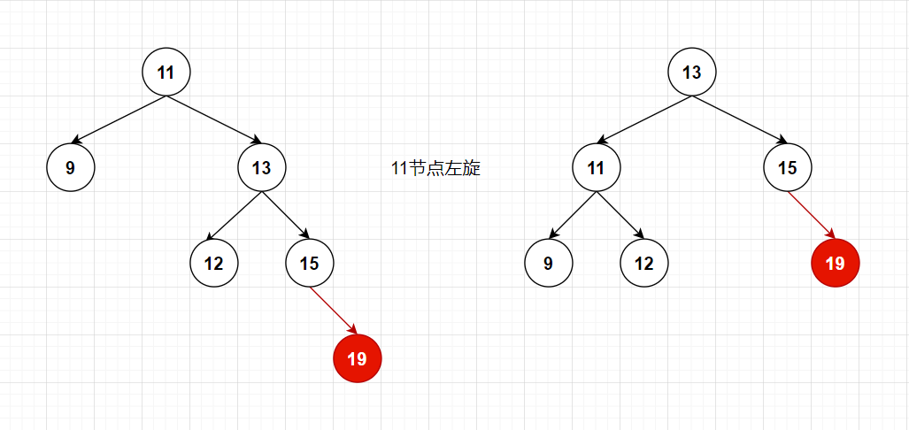
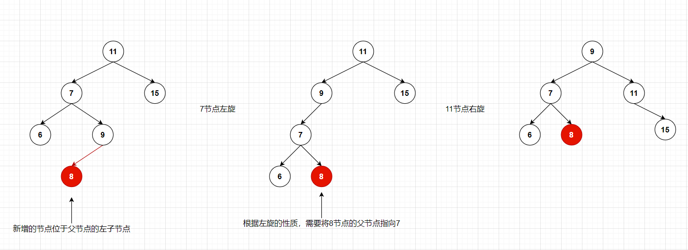
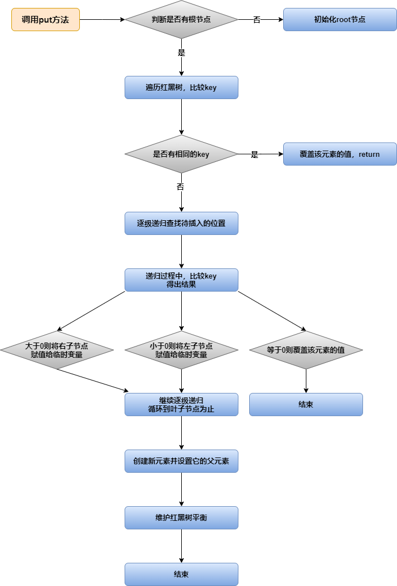

# TreeMap

## 二叉查找树

**特点：**

1. 若左子树不空，则左子树上所有的值均小于它的根节点的值。
2. 若右子树不空，则右子树上所有的值均大于它的根节点的值。
3. 左右子树均分别为二叉排序树。
4. 没有相等的节点。

**二叉查找树就是每个节点的值按照大小排列的二叉树**，**二叉查找树方便对节点的值进行查找。**



## 二叉查找树的查找规则

1. 从根节点开始，如果要查找的值等于节点的值，则返回。
2. 如果要查找的值小于节点的值，那就在左子树中递归查找。
3. 如果要查找的值大于节点的值，那就在左子树中递归查找。



## 平衡二叉树

​		为了避免出现“瘸子”的现象，减少树的高度，提高我们的搜索效率，又存在一种树的结构“平衡二叉树”，它的左右两个子树高度差的绝对值不超过1，并且左右两个子树都是一颗平衡二叉树。



## 平衡二叉树的旋转

**旋转的性质**

1. **左旋**：就是将节点的**右支往左拉**，**右子节点变成父节点**，并把晋升之后多余的**左子节点**让给降级节点的**右子节点**。
2. **右旋**：就是将节点的**左支往右拉**，**左子节点变成父节点**，并把晋升之后多余的**右子节点**让给降级节点的**左子节点**。

**四种失衡的情况：**

**左左情况，需要以10为基准节点进行右旋**



**左右情况，需要以7节点左旋，然后以11节点右旋**



**右左情况，需要以15节点右旋，然后以11节点左旋**



**右右情况，只需11节点左旋**



**注意**：**在进行旋转维护失衡的过程中，需要根据是左旋还是右旋的情况，把多余的节点重新指定父节点。**

**例如左右情况，实际上左右情况还分为两种：**

1. 新增的节点（**图中红色的节点**）是父节点的左子节点。

   

2. 新增的节点是父节点的右子节点，这种情况依照上述分析左右情况的例子即可。

**右左情况也是类似的，这里讲一下需要重新指定父节点的情况：**

新增的节点（**图中红色的节点**）是父节点的左子节点。


## 红黑树

### 描述

1. 红黑树是一种自平衡的二叉查找树。
2. 红黑树的每一个节点都有存储位表示节点的颜色，可以是红或黑。
3. 红黑树不是高度平衡的，它的平衡是通过红黑树的特性进行实现的。

### 特性

1. 每一个节点或是红色，或是黑色。
2. 根节点必须是黑色。
3. 每个叶子节点是黑色的。（Nil这里叶子节点，是指为空）。
4. 如果一个节点是红色，则它的子节点必须是黑色。
5. 从一个节点到该节点的子孙节点的所有路径上包含相同数目的黑节点（这里指到叶子节点的路径）。


## TreeMap

​		**TreeMap底层是红黑树的数据结构，元素中的键重复会覆盖；元素会按照大小顺序排序。**

### 类的层级关系

```java
public class TreeMap<K,V>
    extends AbstractMap<K,V>
    implements NavigableMap<K,V>, Cloneable, java.io.Serializable
```

### 类相关属性

```java
// 比较器用于维护此树形结构的顺序，如果比较器使用其键的自然顺序，则为null。
private final Comparator<? super K> comparator;
// 红黑树的根节点
private transient Entry<K,V> root = null;
// 红黑树的节点数量
private transient int size = 0;
// 对树的结构修改次数。
private transient int modCount = 0;
```

### 构造函数

```java
// 无参数构造，比较器为null
public TreeMap() {
    comparator = null;
}
// 初始化一个比较器
public TreeMap(Comparator<? super K> comparator) {
    this.comparator = comparator;
}
// 根据传入的Map，初始化TreeMap
public TreeMap(Map<? extends K, ? extends V> m) {
    comparator = null;
    putAll(m);
}
// 根据传入的SortedMap家族成员，初始化TreeMap
public TreeMap(SortedMap<K, ? extends V> m) {
    comparator = m.comparator();
    try {
        buildFromSorted(m.size(), m.entrySet().iterator(), null, null);
    } catch (java.io.IOException cannotHappen) {
    } catch (ClassNotFoundException cannotHappen) {
    }
}
```

### 常用方法原理

我们先来看看put方法

```java
public V put(K key, V value) {
    Entry<K,V> t = root;
    if (t == null) {
        compare(key, key); // type (and possibly null) check

        root = new Entry<>(key, value, null);
        size = 1;
        modCount++;
        return null;
    }
    int cmp;
    Entry<K,V> parent;
    // split comparator and comparable paths
    Comparator<? super K> cpr = comparator;
    if (cpr != null) {
        do {
            parent = t;
            cmp = cpr.compare(key, t.key);
            if (cmp < 0)
                t = t.left;
            else if (cmp > 0)
                t = t.right;
            else
                return t.setValue(value);
        } while (t != null);
    }
    else {
        if (key == null)
            throw new NullPointerException();
        Comparable<? super K> k = (Comparable<? super K>) key;
        do {
            parent = t;
            cmp = k.compareTo(t.key);
            if (cmp < 0)
                t = t.left;
            else if (cmp > 0)
                t = t.right;
            else
                return t.setValue(value);
        } while (t != null);
    }
    Entry<K,V> e = new Entry<>(key, value, parent);
    if (cmp < 0)
        parent.left = e;
    else
        parent.right = e;
    fixAfterInsertion(e);
    size++;
    modCount++;
    return null;
}
```

大概的流程是这样滴

1. 首先，它去判断有没有根节点，若没有则初始化根节点。

   ① 创建根节点之前，它会去判断key是否为null，为null则抛出空指针异常，这里可以知道TreeMap是不允许key为null的。

   ② 创建一个根节点，它的父亲节点为null。

   ③ 初始化工作结束，return。

2. 开始遍历红黑树（**为了查找新增元素需要插入到什么位置**），这里分两种情况进行key的比较。

   ① 使用的是自定义的比较器

   ② 使用的是key默认的比较器

   不管使用的哪种比较器，目的都是为了排序。由于TreeMap不允许key为null，所以在实现自定义比较的时候应该将null的这种情况也考虑进去。

   首先，新增元素的key会和当前节点的key比较

   - 如果小于当前节点的key，则将当前节点的**左子节点**赋值给**临时变量**，然后再根据临时变量递归往下比较，直到循环到叶子节点为止。
   - 如果大于当前节点的key，则将当前节点的**右子节点**赋值给**临时变量**，然后再递归比较，直到循环到叶子节点为止。
   - 如果等于当前节点的key，则覆盖该节点的值，然后return出去。
   
   循环结束后，临时变量存储的就是**新增元素的父元素。**
   
3. 创建新元素并指定父元素，并维护父元素和新元素的子节点关系，根据cmp变量判断是父元素的左子节点还是右子节点。

   - 如果**小于0**，则是父元素的**左子节点**。

   - 如果**大于0**，则是父元素的**右子节点**。

4. 因为每次新增元素都可能导致红黑树不平衡，通过这个方法【fixAfterInsertion】去维护树的平衡。

   
   
   大致的流程图：
   
   


