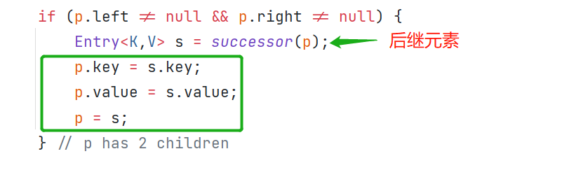
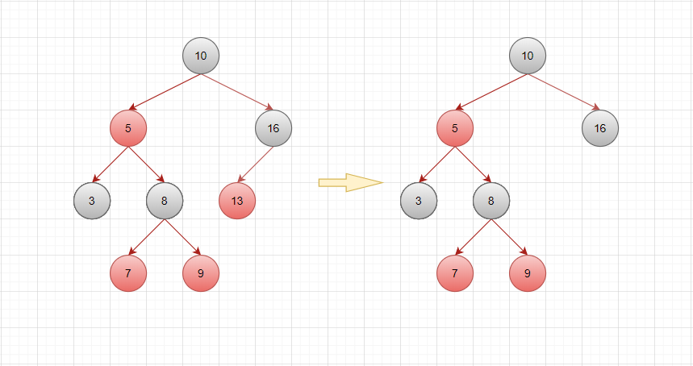

# TreeMap

​		这篇文章，我们主要来讲讲红黑树这种数据结构。在这之前，我们要必要先来了解什么是二叉查找树，了解了二叉查找树明白了它的不足引申出了平衡二叉树，进而就有红黑树。

## 二叉查找树

**特点：**

1. 若左子树不空，则左子树上所有的值均小于它的根节点的值。
2. 若右子树不空，则右子树上所有的值均大于它的根节点的值。
3. 左右子树均分别为二叉排序树。
4. 没有相等的节点。

**二叉查找树就是每个节点的值按照大小排列的二叉树**，**二叉查找树方便对节点的值进行查找。**


## 二叉查找树的查找规则

1. 从根节点开始，如果要查找的值等于节点的值，则返回。
2. 如果要查找的值小于节点的值，那就在左子树中递归查找。
3. 如果要查找的值大于节点的值，那就在左子树中递归查找。


## 平衡二叉树

​		为了避免出现“瘸子”的现象，减少树的高度，提高我们的搜索效率，又存在一种树的结构“平衡二叉树”，它的左右两个子树高度差的绝对值不超过1，并且左右两个子树都是一颗平衡二叉树。


## 平衡二叉树的旋转

**旋转的性质**

1. **左旋**：就是将节点的**右支往左拉**，**右子节点变成父节点**，并把晋升之后多余的**左子节点**让给降级节点的**右子节点**。
2. **右旋**：就是将节点的**左支往右拉**，**左子节点变成父节点**，并把晋升之后多余的**右子节点**让给降级节点的**左子节点**。

**四种失衡的情况：**

**左左情况，需要以10为基准节点进行右旋**


**左右情况，需要以7节点左旋，然后以11节点右旋**


**右左情况，需要以15节点右旋，然后以11节点左旋**


**右右情况，只需11节点左旋**


**注意**：**在进行旋转维护失衡的过程中，需要根据是左旋还是右旋的情况，把多余的节点重新指定父节点。**

**例如左右情况，实际上左右情况还分为两种：**

1. 新增的节点（**图中红色的节点**）是父节点的左子节点。

   

2. 新增的节点是父节点的右子节点，这种情况依照上述分析左右情况的例子即可。

**右左情况也是类似的，这里讲一下需要重新指定父节点的情况：**

新增的节点（**图中红色的节点**）是父节点的左子节点。


## 红黑树

### 描述

1. 红黑树是一种自平衡的二叉查找树。
2. 红黑树的每一个节点都有存储位表示节点的颜色，可以是红或黑。
3. 红黑树不是高度平衡的，它的平衡是通过红黑树的特性进行实现的。

### 特性

1. 每一个节点或是红色，或是黑色。
2. 根节点必须是黑色。
3. 每个叶子节点是黑色的。（Nil这里叶子节点，是指为空）。
4. 如果一个节点是红色，则它的子节点必须是黑色。
5. 从一个节点到该节点的子孙节点的所有路径上包含相同数目的黑节点（这里指到叶子节点的路径）。


## TreeMap

​		**TreeMap底层是红黑树的数据结构，元素中的键重复会覆盖；元素会按照大小顺序排序。**

### 类的层级关系

```java
public class TreeMap<K,V>
    extends AbstractMap<K,V>
    implements NavigableMap<K,V>, Cloneable, java.io.Serializable
```

### 类相关属性

```java
// 比较器用于维护此树形结构的顺序，如果比较器使用其键的自然顺序，则为null。
private final Comparator<? super K> comparator;
// 红黑树的根节点
private transient Entry<K,V> root = null;
// 红黑树的节点数量
private transient int size = 0;
// 对树的结构修改次数。
private transient int modCount = 0;
```

### 构造函数

```java
// 无参数构造，比较器为null
public TreeMap() {
    comparator = null;
}
// 初始化一个比较器
public TreeMap(Comparator<? super K> comparator) {
    this.comparator = comparator;
}
// 根据传入的Map，初始化TreeMap
public TreeMap(Map<? extends K, ? extends V> m) {
    comparator = null;
    putAll(m);
}
// 根据传入的SortedMap家族成员，初始化TreeMap
public TreeMap(SortedMap<K, ? extends V> m) {
    comparator = m.comparator();
    try {
        buildFromSorted(m.size(), m.entrySet().iterator(), null, null);
    } catch (java.io.IOException cannotHappen) {
    } catch (ClassNotFoundException cannotHappen) {
    }
}
```

### 常用方法原理

我们先来看看put方法

```java
public V put(K key, V value) {
    Entry<K,V> t = root;
    if (t == null) {
        compare(key, key); // type (and possibly null) check

        root = new Entry<>(key, value, null);
        size = 1;
        modCount++;
        return null;
    }
    int cmp;
    Entry<K,V> parent;
    // split comparator and comparable paths
    Comparator<? super K> cpr = comparator;
    if (cpr != null) {
        do {
            parent = t;
            cmp = cpr.compare(key, t.key);
            if (cmp < 0)
                t = t.left;
            else if (cmp > 0)
                t = t.right;
            else
                return t.setValue(value);
        } while (t != null);
    }
    else {
        if (key == null)
            throw new NullPointerException();
        Comparable<? super K> k = (Comparable<? super K>) key;
        do {
            parent = t;
            cmp = k.compareTo(t.key);
            if (cmp < 0)
                t = t.left;
            else if (cmp > 0)
                t = t.right;
            else
                return t.setValue(value);
        } while (t != null);
    }
    Entry<K,V> e = new Entry<>(key, value, parent);
    if (cmp < 0)
        parent.left = e;
    else
        parent.right = e;
    fixAfterInsertion(e);
    size++;
    modCount++;
    return null;
}
```

流程是这样滴

1. 首先，它去判断有没有根节点，若没有则初始化根节点。

   ① 创建根节点之前，它会去判断key是否为null，为null则抛出空指针异常，这里可以知道TreeMap是不允许key为null的。

   ② 创建一个根节点，它的父亲节点为null。

   ③ 初始化工作结束。

2. 开始遍历红黑树（**为了查找新增元素需要插入到什么位置**），这里分两种情况进行key的比较。

   ① 使用的是自定义的比较器

   ② 使用的是key默认的比较器

   不管使用的哪种比较器，目的都是为了排序。由于TreeMap不允许key为null，所以在实现自定义比较的时候应该将null的这种情况也考虑进去。

   首先，新增元素的key会和当前节点的key比较

   - 如果小于当前节点的key，则将当前节点的**左子节点**赋值给**临时变量**，然后再根据临时变量递归往下比较，直到循环到叶子节点为止。
   - 如果大于当前节点的key，则将当前节点的**右子节点**赋值给**临时变量**，然后再递归比较，直到循环到叶子节点为止。
   - 如果等于当前节点的key，则覆盖该节点的值。
   
   循环结束后，临时变量存储的就是**新增元素的父元素。**
   
3. 创建新元素并指定父元素，并维护父元素和新元素的关系，根据cmp变量判断是父元素的左子节点还是右子节点。

   - 如果**小于0**，则是父元素的**左子节点**。

   - 如果**大于0**，则是父元素的**右子节点**。

4. 因为每次新增元素都可能导致红黑树不平衡，通过这个方法【fixAfterInsertion】去维护树的平衡。

   
   
   大致的流程图：
   
   
   
   ​		只有不满足红黑树的特性，才需要维护红黑树。新增的元素默认是红色，当它的父元素也是红色的时候，就不满足红黑树的特性的第四点（如果一个节点是红色，则它的子节点必须是黑色），然后通过各种左旋，右旋，赋予颜色值等操作使它重新具备红黑树的性质。直接上图。


​		还是不好理解？来看看下面这张图，基本包含了所有新增元素需要调整平衡的情况。


​		当新增元素9并且已经具备红黑树的性质时，可以看出红黑树与平衡二叉树之间的区别。此时的树形结构对于平衡二叉树来说是不平衡的，而红黑树则认可这种结构。所以平衡二叉树拥有追求绝对的平衡的性质，以至于每次插入元素都需要旋转多少次难以预知；红黑树则放弃绝对的平衡，以大致平衡的情况下最多旋转三次（插入最多两次，删除最多三次）可达到平衡。

​		好了，插入元素到这里就告一段落了。下面讲讲比插入稍微复杂一点的删除元素操作。


附上源码

```java
public V remove(Object key) {
    // 通过遍历获取到要删除的元素
    Entry<K,V> p = getEntry(key);
    if (p == null)
        return null;
    V oldValue = p.value;
    deleteEntry(p);
    return oldValue;
}

private void deleteEntry(Entry<K,V> p) {
    modCount++;
    size--;

    // If strictly internal, copy successor's element to p and then make p
    // point to successor.
    // 要删除的元素（DE）有左右子元素
    if (p.left != null && p.right != null) {
        // 获取后继元素
        Entry<K,V> s = successor(p);
        // 后继元素的key和value赋值给DE
        p.key = s.key;
        p.value = s.value;
        p = s;
    } // p has 2 children

    // Start fixup at replacement node, if it exists.
    Entry<K,V> replacement = (p.left != null ? p.left : p.right);

    if (replacement != null) {
        // Link replacement to parent
        replacement.parent = p.parent;
        if (p.parent == null)
            root = replacement;
        else if (p == p.parent.left)
            p.parent.left  = replacement;
        else
            p.parent.right = replacement;

        // Null out links so they are OK to use by fixAfterDeletion.
        p.left = p.right = p.parent = null;

        // Fix replacement
        if (p.color == BLACK)
            fixAfterDeletion(replacement);
    } else if (p.parent == null) { // return if we are the only node.
        root = null;
    } else { //  No children. Use self as phantom replacement and unlink.
        if (p.color == BLACK)
            fixAfterDeletion(p);

        if (p.parent != null) {
            if (p == p.parent.left)
                p.parent.left = null;
            else if (p == p.parent.right)
                p.parent.right = null;
            p.parent = null;
        }
    }
}
```

删除元素大概分为三种情况：

1. 该元素有左右子元素

   ① 首先，它会去找到要删除元素（设为DE）的后继元素

   ​		1）**当DE存在右子元素时**，就会去查找大于DE的所有元素中**最小**的那个。由于右子元素结构树的所有元素都是比DE大的，只要根据这个右子元素往左边逐级向下查找，最后那一个元素就是我们要的**后继元素**。

   ​		2）**当DE不存在右子元素时**，这里需要说一下，通过remove方法是不会发生这种情况的。因为正常走**remove**方法能够调用**successor**这个方法的只有当**左右子元素**都不为空的情况下。**当DE不存在右子元素**的这种情况在迭代遍历元素的时候会用到，（后面具体讲讲这种情况）。

   ​		**successor方法找到后继元素都是按照1）、2）这两种情况去查找的。**

   ```java
   static <K,V> TreeMap.Entry<K,V> successor(Entry<K,V> t) {
       if (t == null)
           return null;
       // 1）当DE存在右子元素时
       else if (t.right != null) {
           // 获取DE的右子元素
           Entry<K,V> p = t.right;
           // 往左边逐级向下查找
           while (p.left != null)
               p = p.left;
           // 最后一个左子元素（不包括叶子元素）
           return p;
       }
       // 2）当DE不存在右子元素时
       else {
           // 获取DE的父元素
           Entry<K,V> p = t.parent;
          	// 用一个临时变量ch指向DE
           Entry<K,V> ch = t;
           // 父元素不为空 & ch是父元素的右子元素
           // 这两个条件同时满足才进入循环
           // 相当于逐级向上遍历，当找到父元素是爷爷元素的左子节点的时候
           // 那这个爷爷元素就是我们要找的后继元素
           while (p != null && ch == p.right) {
               ch = p;
               p = p.parent;
           }
           return p;
       }
   }
   ```

   ② 现在我们有两个已知元素（DE和DE的后继元素），将DE的key和value指向它后继元素的key和value（相当于删除了原来的DE元素，用后继元素代替了DE）。

   

   **如果后继元素的颜色是黑色则需要修复红黑树**，这里还需要将后继元素与它原来的父元素断开关联（彻底断绝父子关系，重新当别人的儿子）。

   ```java
   // 修复红黑树
   if (p.color == BLACK)
       fixAfterDeletion(p);
   // 与它原来的父元素断开关联
   if (p.parent != null) {
       if (p == p.parent.left)
           p.parent.left = null;
       else if (p == p.parent.right)
           p.parent.right = null;
       p.parent = null;
   }
   ```

   重点说说红黑树的修复，需要修复的情况有四种

   ​		① 当要删除的元素只存在一个子元素或不存在子元素 。

   ​			1）如果要删除的元素是红色，那就直接删除就完事儿了。

   ​		

   ​			2）如果是这种情况，DE是父元素的左子元素，它与兄弟元素都是黑色，并且兄弟元素的子元素全是红色。

   ​		

   ​			3）它与兄弟元素都是黑色，并且兄弟元素的左子元素是红色，右子元素是黑色。

   ​			

   ​			4）删除一个带有子元素的元素（DE），将会用子元素代替，充当被删除元素的位置。

   ​			

   

   ​		② 当要删除的元素的两个子节点同时存在，并且后继元素为黑色。

   

2. 该元素只有左子元素

3. 该元素只有右子元素

4. 该元素没有子元素

